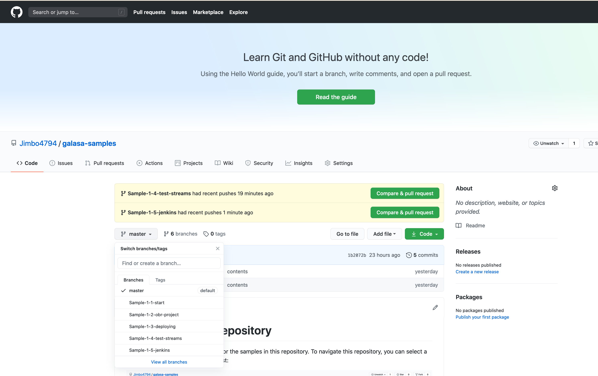

# Galasa Samples Repository

This is the main page and contents for the samples in this repository. To navigate this repository, you can select a sample and stage from the branch list:

## Contents

1. Sample 1 - Converting and running a local tests in automation
    1. Start - shows a sample project that we are going to convert
    2. Parents and OBR's - convert our starting project to the structure required to run in automation
    3. Deploying - deploy our test artifacts to a maven repository
    4. Test Streams - Setting up a new test stream on our ecosystem
    5. Jenkins and Automation - How to call and run our tests in automation
