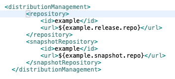
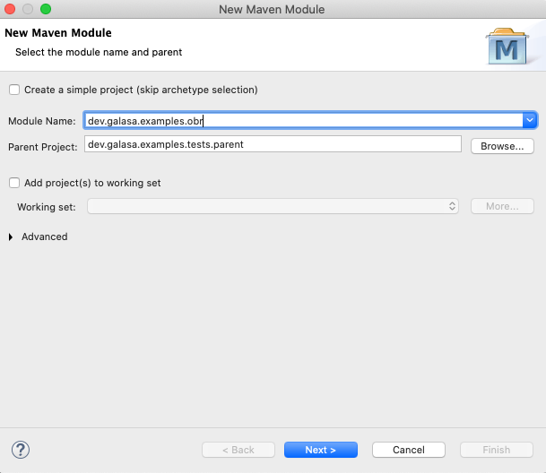
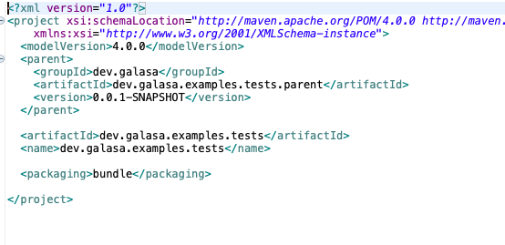
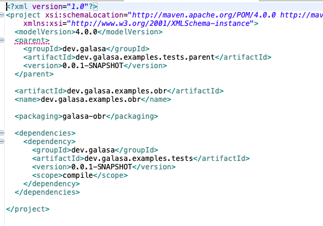
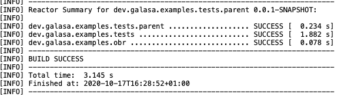
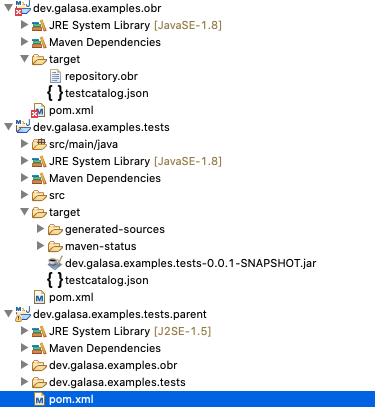

# Sample 1 Guide - Converting and running a local tests in automation

The first thing we need to do is to restructure our project. To wrapper all of our related artifacts for this test (which could easily be a set of tests), we are going to create a parent project. We are then going to create a new project to generate the OBR. The stucture should like this:

```
+-- dev.galasa.examples.tests.parent
|   +-- dev.galasa.examples.tests
|       +-- src
|       +-- pom.xml
|   +-- dev.galasa.examples.obr
|       +-- pom.xml
|   +-- pom.xml
```

I find the easiest way to do this is to rename the project that we started with to the parent and then editing the pom:



Important things to take note of intially is the change of `<packaing>` to pom. (This basically tells maven to create no output, as this is a container for submodules). Our child projects can utilise all the dependancies and properties from this parent.

The modules that can be seen can then be easily added to our parent pom, and if using eclipse we can use: 


If we go ahead and create two modules, `dev.galasa.examples.tests` and `dev.galasa.exaples.obr`:



We can then move our `SampleTests.java` class to the new `dev.galasa.examples.tests` module. The pom for this module is simple, containing a refernce to the parent project, the artifact information and then a packaging of `<packaging>bundle</packaging>` as before:



For the OBR project we can remove the `src` dir and projects as they will not be required. The packaging type for this project is a custom one we provide called `<packaging>galasa-obr</packaging>`. This pom should reference our project that contains our test code so it can be added to the OBR:



This pom may have errors saying that it is not covered by the lifecycle.

We also need to edit the build phase of our parent POM:


These changes allow for the galasa style bundles to be generated. One thing to note is the `buildtestcat` goal of the plugin. This goal automatically generates the artifact that forms the test catalog. When we then build our projects, we will see a testcatalog.json that is in the build output. In the example code in this repo I have left the target dir in the OBR project where you can see an example of the OBR produced and the test catalog created.

Peforming a Maven install on this project should build all the artifacts and looking something like this:



