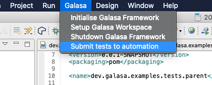
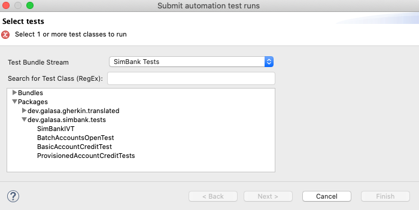
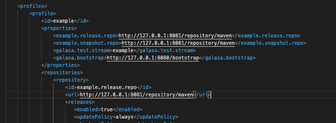
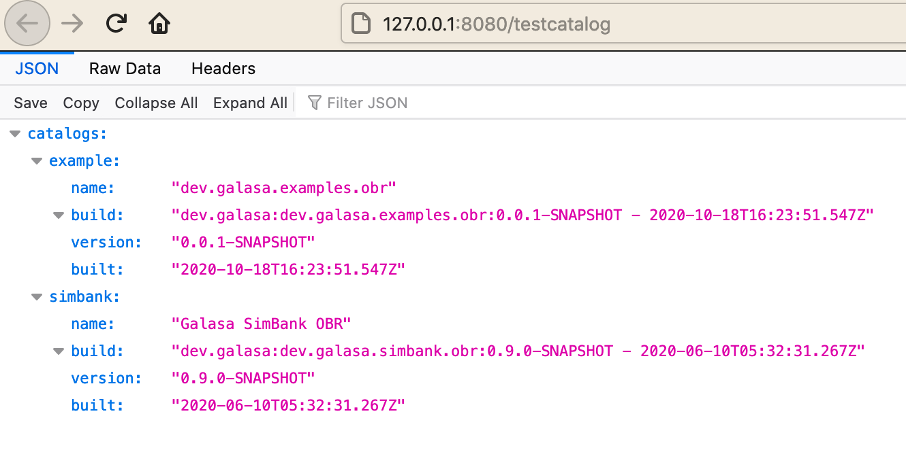
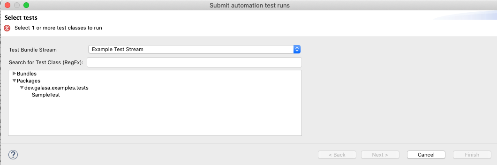
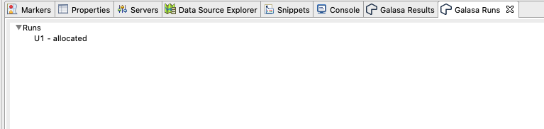
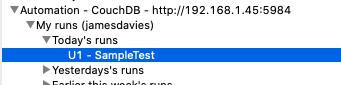

# Sample 1 Guide - Converting and running a local tests in automation

Now we have our test artifacts, OBR and test catalog hosted in a central location, we are almost ready to start running in automation. The last step is to set up a test stream. In the docker operator, we setup an example test stream for running the simbank tests. We can see this if we open the test automation submit view using:



This opens a view where we can see all the available test streams and the packages they offer. Again if you are using the docker operator, there is a simbank example:



I could select one of the four tests here and have them run headlessly in the galasa ecosystem. But how do we now add our new test to this menu?

The first step is to deploy out new test catalog that was generated in the build (testcatalog.json). We can do this with a quick ammendment to our settings.xml that we created last step. We need to add a stream name and the lcoation of our ecosystems bootstrap properties, which we can do with these two new properties:



Once our `settings.xml` has been updated with `<galasa.test.stream>` and `<galasa.bootstrap>` properties, we can also ammend our deploy job. Again if we  look at the eclipse method, we can simply add a new goal to our run configuration. The goal `dev.galasa:galasa-maven-plugin:deploytestcat` will add the generted test catalog to our api server. We can see our new catalog available at `http://<XXX>:8080/testcatalog` where `<XXX>` is your hostname, so in my example `http://127.0.0.1:8080/testcatalog`:



You can also view individual catalogs but going to `http://<XXX>:8080/testcatalog/<streamName>`, E.G `http://127.0.0.1:8080/testcatalog/example`

Now we have a live catalog of tests! Now that all that is required is to add a few properties to our CPS so that galasa knows where to find our catalog and test material. The properties we need are:
```
# A comma seperated list of all the different test streams
framework.test.streams

# A url of the maven repository used to house the test material
framework.test.stream.<streamName>.repo

# The specific obr version to be used
framework.test.stream.<streamName>.obr

# The location of the test catalog on the api server
framework.test.stream.<streamName>.location

# A basic description for the stream, this will appear in the eclipse plugin
framework.test.stream.<streamName>.description
```
There is several ways that we can add these to our CPS. You can use the `etcdctl` CLI tool which you can install on your local machine and then setting the two environment variables:

```
ETCDCTL_API=3
ETCDCTL_ENDPOINTS=<XXX>
```

Where `<XXX>` is the hostname of the etcd cluster used to host the CPS.

However, to avoid having to install any new software, we can use docker commands to interact with our container that hosts the CPS. Using the command:

```
docker exec -it galasa_cps /bin/sh
```
This will start a session with the container that is hosting the cps, which already has `etcdctl` installed and configured.

From this point we need to add several properties using the command of `etcdctl put <key> <value>`. This is to fuly define the test stream and the location of all the test artifacts to galasa. This can be made easier with a shell script if being commonly done, but you can also just run these commands (edited to your own needs):

```
etcdctl put framework.test.streams SIMBANK,EXAMPLE
etcdctl put framework.test.stream.EXAMPLE.repo http://<XXX>:8081/repository/maven
etcdctl put framework.test.stream.EXAMPLE.obr mvn:dev.galasa/dev.galasa.examples.obr/0.0.1-SNAPSHOT/obr
etcdctl put framework.test.stream.EXAMPLE.location http://<XXX>:8080/testcatalog/example
etcdctl put framework.test.stream.EXAMPLE.description "Example Test Stream"
```

Note that `framework.test.streams` is a comma seperated list. If `etcdctl get framework.test.streams `returns a stream already (like SIMBANK in this example), this will need to be added in addtion to our new stream.

We now have one more step before we can run our test in the ecosystem, and that is to define all the properties required for the run, as per the CPS and CREDS files in step one of this sample. The folllowing set of properties are all that are required to run the very simple sample test in our example. Again these commands have to be run inside the session inside the CPS container.

```
etcdctl put zos.cluster.DEFAULT.images MYTESTIMAGE
etcdctl put zos.image.MYTESTIMAGE.ipv4.hostname <XXX>
etcdctl put zos.image.MYTESTIMAGE.telnet.port <XXX>
etcdctl put zos.image.MYTESTIMAGE.telnet.tls false
etcdctl put zos.image.MYTESTIMAGE.credentials <XXX>
etcdctl put zos.image.MYTESTIMAGE.max.slots 2
etcdctl put zos.tag.MYTESTIMAGE.clusterid DEFAULT
etcdctl put secure.credentials.plex2.username <XXX>
etcdctl put secure.credentials.plex2.password <XXX>
```

Now if we go to the `Submit tests to automation` window in eclipse, we should see a new test stream available to us:



Inside this stream we should be able to access out new test! Using the next window we can request TRACE output, or pass additional/overriding properties to the test, but for this example we can just click finish. If you have the Galasa Runs view open (the galasa logo on the main bar), you should be able to see: 



Once finished, in our Galasa Results view we should be able to see the new run (might have to right click refresh):



You can double click on this to check it passed, but you have just run a test in automation!