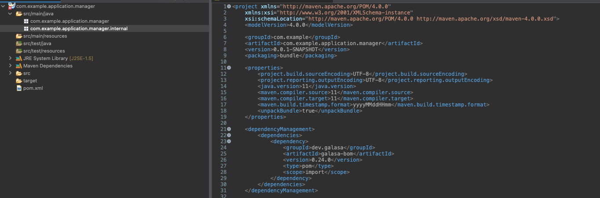
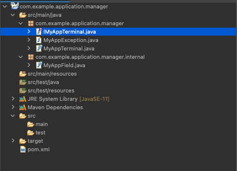

# Writing a Manager

This document is to cover the creation of a very basic manager and some of the concepts. For this manager I am pretending I have an application which I am trying to encapsulate for simple use for my testers.

### My App

For this example I want to create a manager that will help testers interact and provision tests of "My App". This is going to do several things:
1. Configure my test to locate a LPAR my test is running on
2. Configure a 3270 Terminal to connect to that LPAR
3. Perform some basic 3270 interactions to sign me into my application (handle credentials and navigation)

The idea here is to demonstrate that we can do more with a manager that just interact with a technology. We can code in context knowledge into our manager to reduce repeated steps in tests. This also means that if a application ever changes something like the login process, we only have to resolve this in 1 manager, rather than 1000's of tests.

### Setting Up the Basic Project
To start, we need a maven project to build in:

 

There are two empty packages in place:
- `com.example.application.manager` - This is going to house all of the Classes that a tester will be interacting with. (The annotations themselves, the Object the Annotation provides and the JavaException for this manager)
- `com.example.application.manager.internal` - This will contain all of the actually implementation code that will perform the work.

I have also setup the pom.xml with a few dependencies that looks like:

 ```
 <project xmlns="http://maven.apache.org/POM/4.0.0"
	xmlns:xsi="http://www.w3.org/2001/XMLSchema-instance"
	xsi:schemaLocation="http://maven.apache.org/POM/4.0.0 http://maven.apache.org/xsd/maven-4.0.0.xsd">
	<modelVersion>4.0.0</modelVersion>

	<groupId>com.example</groupId>
	<artifactId>com.example.application.manager</artifactId>
	<version>0.1.0</version>
	<packaging>bundle</packaging>
	
	<properties>
		<project.build.sourceEncoding>UTF-8</project.build.sourceEncoding>
		<project.reporting.outputEncoding>UTF-8</project.reporting.outputEncoding>
		<java.version>11</java.version>
		<maven.compiler.source>11</maven.compiler.source>
		<maven.compiler.target>11</maven.compiler.target>
		<maven.build.timestamp.format>yyyyMMddHHmm</maven.build.timestamp.format>
		<unpackBundle>true</unpackBundle>
	</properties>

	<dependencyManagement>
		<dependencies>
			<dependency>
				<groupId>dev.galasa</groupId>
				<artifactId>galasa-bom</artifactId>
				<version>0.24.0</version>
				<type>pom</type>
				<scope>import</scope>
			</dependency>
		</dependencies>
	</dependencyManagement>

	<dependencies>
		<dependency>
			<groupId>dev.galasa</groupId>
			<artifactId>dev.galasa.framework</artifactId>
		</dependency>
		<dependency>
			<groupId>dev.galasa</groupId>
			<artifactId>dev.galasa</artifactId>
		</dependency>
		<dependency>
			<groupId>dev.galasa</groupId>
			<artifactId>dev.galasa.zos.manager</artifactId>
		</dependency>
		<dependency>
			<groupId>dev.galasa</groupId>
			<artifactId>dev.galasa.zos3270.manager</artifactId>
		</dependency>
		<dependency>
			<groupId>commons-logging</groupId>
			<artifactId>commons-logging</artifactId>
		</dependency>
		<dependency>
			<groupId>javax.validation</groupId>
			<artifactId>validation-api</artifactId>
		</dependency>
		<dependency>
			<groupId>org.osgi</groupId>
			<artifactId>org.osgi.service.component.annotations</artifactId>
		</dependency>
	</dependencies>

	<build>
		<pluginManagement>
			<plugins>
				<plugin>
					<groupId>org.eclipse.m2e</groupId>
					<artifactId>lifecycle-mapping</artifactId>
					<version>1.0.0</version>
					<configuration>
						<lifecycleMappingMetadata>
							<pluginExecutions>
								<pluginExecution>
									<pluginExecutionFilter>
										<groupId>org.apache.felix</groupId>
										<artifactId>maven-bundle-plugin</artifactId>
										<versionRange>[5.1.1,)</versionRange>
										<goals>
											<goal>bundle</goal>
										</goals>
									</pluginExecutionFilter>
									<action>
										<execute>
											<runOnConfiguration>true</runOnConfiguration>
											<runOnIncremental>true</runOnIncremental>
										</execute>
									</action>
								</pluginExecution>
							</pluginExecutions>
						</lifecycleMappingMetadata>
					</configuration>
				</plugin>
			</plugins>
		</pluginManagement>

		<plugins>
			<plugin>
				<groupId>org.apache.felix</groupId>
				<artifactId>maven-bundle-plugin</artifactId>
				<version>5.1.1</version>
				<extensions>true</extensions>
			</plugin>
		</plugins>
	</build>

</project>
```
### Creating an annotation
To create an Galasa annotation we need three things, the Class to define the interface the user will interact with, the class to define the annotation itself, a class to define a grouping annotation. So starting with the interface for the user object (we call this a TPI in Galasa)

### `IMyAppTerminal.java`
```
package com.example.application.manager;

import dev.galasa.zos3270.ITerminal;

public interface IMyAppTerminal extends ITerminal{
	void goToMainScreen() throws MyAppException;
}
```
This is a very simple class as we are extending the default 3270 Terminal built into Galasa to allow us to add some initial navigation to my terminal, as well as some addition functionality like the `goToMainScreen()`.

For a tester to be able to use this object and for Galasa to reflect a real implementation into this object, we need to attach it to an annotation.
### `MyAppTerminal.java`

```
package com.example.application.manager;

import java.lang.annotation.ElementType;
import java.lang.annotation.Retention;
import java.lang.annotation.RetentionPolicy;
import java.lang.annotation.Target;

import com.example.application.manager.internal.MyAppField;

import dev.galasa.framework.spi.ValidAnnotatedFields;

@Retention(RetentionPolicy.RUNTIME)
@Target({ ElementType.FIELD })
@MyAppField
@ValidAnnotatedFields({ IMyAppTerminal.class })
public @interface MyAppTerminal {
}
```
Which at first glance is an empty class. I could be adding fields to this class, but for this example we dont need to. But for an example look at the Account annotation in the Simbank examples for a reference.

The annotations in the class are the important bits, so here is a breakdown of what they all do:
- `@Retention(RetentionPolicy.RUNTIME)` - indicates to the VM that our annotation is used at both compile and runtime.
- `@Target({ ElementType.FIELD })` - indicates at the context at which our annotation is applicable.
- `@MyAppField` -  is another annotation we are about to define inside our internal package, we will come back to this.
- `@ValidAnnotatedFields({ IMyAppTerminal.class })` - Is used to both define and validate what object interface we are expecting the object that will populate our interface once instantiated by out manager.

But it is also possible for a manager to "own" multiple annotations. For this reason we need to be able to group annotations, which we do with another annotation (you will see why later):
### `MyAppField.java`
```
package com.example.application.manager.internal;

import java.lang.annotation.ElementType;
import java.lang.annotation.Retention;
import java.lang.annotation.RetentionPolicy;
import java.lang.annotation.Target;

@Retention(RetentionPolicy.RUNTIME)
@Target({ ElementType.TYPE })
public @interface MyAppField {
}
```
This second annotation is completely empty except our defining annotations.

I have also included a custom Exception we will use:
### `MyAppException.java`
```
package com.example.application.manager;

import dev.galasa.ManagerException;

public class MyAppException extends ManagerException {
    private static final long serialVersionUID = 1L;

    public MyAppException() {
    }

    public MyAppException(String message) {
        super(message);
    }

    public MyAppException(Throwable cause) {
        super(cause);
    }

    public MyAppException(String message, Throwable cause) {
        super(message, cause);
    }

    public MyAppException(String message, Throwable cause, boolean enableSuppression,
            boolean writableStackTrace) {
        super(message, cause, enableSuppression, writableStackTrace);
    }

}

```
At this point our project should look like this:



With these in place, we have defined out TPI. 

### Fitting into the Test Lifecycle
We now need to move onto some of the Galasa specific components that will allow our manager to fit into the test lifecycle, as well as actually get picked up at runtime. For this simple manager we are only going to interact with 3 components within the test lifecycle: `Initialise, ProvisionGenerate, and ProvisionDiscard`

But before we do that, we need to setup a class which will get recognized by the framework as a manager, which we will do in a file called `MyAppManagerImpl.java`. As a best practice, this class will be used for all the Galasa components, and call out to other classes to perform the actually functionality of this manager.
### `MyAppManagerImpl.java`
```
package com.example.application.manager.internal;

import org.osgi.service.component.annotations.Component;

import dev.galasa.framework.spi.IManager;

@Component(service = { IManager.class})
public class MyAppManagerImpl extends AbstractManager{
}
```
Before we add any code here, it is important to add both the `extends` to the class and the OSGi service component. The service component is what we used in Galasa to identify what classes are managers (which will have all the methods we are expecting a manager to have). The AbstractManager implements `IManager.class` and provides all the components required to be a manager. We will be overriding methods to customise our manager for purpose however.

The first method to override here is the `initalise()` method, as this is what tells Galasa if this manager is needed for a certain test run. For context, the framework will loop through every manager, and ask if the test we are trying to run has any annotations owned by that manager. If the answer is yes then we initialise the manager (and any dependant managers.)
```
@Component(service = { IManager.class})
public class MyAppManagerImpl extends AbstractManager{
	private static final Log logger = LogFactory.getLog(MyAppManagerImpl.class);

    private IZosManagerSpi                     zosManager;
    private IZos3270ManagerSpi                 z3270manager;
	
	@Override
    public void initialise(@NotNull IFramework framework, @NotNull List<IManager> allManagers,
            @NotNull List<IManager> activeManagers, @NotNull GalasaTest galasaTest) throws ManagerException {
        super.initialise(framework, allManagers, activeManagers, galasaTest);

        if(galasaTest.isJava()) {
            List<AnnotatedField> ourFields = findAnnotatedFields(MyAppField.class);
            if (!ourFields.isEmpty()) {
            	logger.info("My App annotation found, initalising");
                youAreRequired(allManagers, activeManagers, galasaTest);
            }
        }
	}

    @Override
	public void youAreRequired(@NotNull List<IManager> allManagers, @NotNull List<IManager> activeManagers, @NotNull GalasaTest galasaTest)
            throws ManagerException {
        if (activeManagers.contains(this)) {
            return;
        }

        activeManagers.add(this);
        zosManager = addDependentManager(allManagers, activeManagers, galasaTest, IZosManagerSpi.class);
        if (zosManager == null) {
            throw new Zos3270ManagerException("The zOS Manager is not available");
        }
        z3270manager = addDependentManager(allManagers, activeManagers, galasaTest, IZos3270ManagerSpi.class);
        if (z3270manager == null) {
            throw new Zos3270ManagerException("The zOS 3270 Manager is not available");
        }
    }
}
```
We need to override two methods to make this possible. `initialise()` and `youAreRequired()`.

The function of these methods respectively:
1. To search for any annotations owned by this manager (`findAnnotatedFields()` is provided from the abstract class)
2. Add this manager to a list of managers to activate, and add any dependancies on other managers we are going to use.

Another method we need to override is:
```
    @Override
	public boolean areYouProvisionalDependentOn(@NotNull IManager otherManager) {
        if (otherManager instanceof IZosManager || otherManager instanceof IZos3270Manager) {
            return true;
        }

        return super.areYouProvisionalDependentOn(otherManager);
    }
```
This isn't obvious from the code, but the framework itself will call this method when running a tests to build up a ordered list of managers which it needs to provision in a specific order. Here we want to make sure both the ZosManager and the Zos3270Manager are provisioned before this manager (as we plan to use them).

The next stage in the Lifecycle that we are concerned about is `ProvisionGenerate`, which is a stage offered to every manager to go away and provision any resource ready for the test. (This stage is followed up by `provisionBuild` and `provisionStart` for more complex cases). So at this point we need to think about what we need to provide to the tester, which is a 3270 terminal connected and navigated to a common start point.

To do this, we need to first locate and LPAR our application is installed in, and then connect a 3270 telenet connection. This raises the design question of how do we want a tester to be able to select an LPAR. We could:

- Allow of a field to be passed on the annotations (@MyAppTerminal(LparTag="MyLpar")), which could directly relate to a zos instance defined in the CPS.
- We can create our own CPS property to define where to direct the test, which this manager looks up.

This is more of a question of how much you want to expose the test configuration to the testers. In the case where I don't want to have my tester be concerned about it at all, I will go with the second approach, as this just allows me to state an annotation. The selected LPAR is then controller by the system administrator who configures galasa (or overrides in the overrides.properties).

### Accessing Properties

Managers have a strict property access mechanism through a Singleton which is configured to only access annotations which are defined for this manager. Managers should NEVER read other managers properties. To start this I am going to create a new package in my project and define a property singleton:

### `MyAppPropertiesSingleton.java`
```
package com.example.application.manager.internal.properties;

import org.osgi.service.component.annotations.Activate;
import org.osgi.service.component.annotations.Component;
import org.osgi.service.component.annotations.Deactivate;
import com.example.application.manager.MyAppException;
import dev.galasa.framework.spi.IConfigurationPropertyStoreService;

@Component(service = MyAppPropertiesSingleton.class, immediate = true)
public class MyAppPropertiesSingleton {

    private static MyAppPropertiesSingleton  INSTANCE;

    private IConfigurationPropertyStoreService cps;

    @Activate
    public void activate() {
        INSTANCE = this;
    }

    @Deactivate
    public void deacivate() {
        INSTANCE = null;
    }

    public static IConfigurationPropertyStoreService cps() throws MyAppException {
        if (INSTANCE != null) {
            return INSTANCE.cps;
        }
        throw new MyAppException("Attempt to access manager CPS before it has been initialised");
    }

    public static void setCps(IConfigurationPropertyStoreService cps) throws MyAppException {
        if (INSTANCE != null) {
            INSTANCE.cps = cps;
            return;
        }
        throw new MyAppException("Attempt to set manager CPS before instance created");
    }
}
```
I can then instantiate this Singleton in my manager at the same time we initialise the manager:
### `MyAppManagerImpl.java`
```
package com.example.application.manager.internal;

import java.util.List;

import javax.validation.constraints.NotNull;

import org.apache.commons.logging.Log;
import org.apache.commons.logging.LogFactory;
import org.osgi.service.component.annotations.Component;

import com.example.application.manager.MyAppException;
import com.example.application.manager.internal.properties.MyAppPropertiesSingleton;

import dev.galasa.ManagerException;
import dev.galasa.framework.spi.AbstractManager;
import dev.galasa.framework.spi.AnnotatedField;
import dev.galasa.framework.spi.IConfigurationPropertyStoreService;
import dev.galasa.framework.spi.IDynamicStatusStoreService;
import dev.galasa.framework.spi.IFramework;
import dev.galasa.framework.spi.IManager;
import dev.galasa.framework.spi.language.GalasaTest;
import dev.galasa.zos.spi.IZosManagerSpi;
import dev.galasa.zos3270.Zos3270ManagerException;
import dev.galasa.zos3270.spi.IZos3270ManagerSpi;

@Component(service = { IManager.class})
public class MyAppManagerImpl extends AbstractManager{
	private static final Log logger = LogFactory.getLog(MyAppManagerImpl.class);
	private final static String NAMESPACE = "myapp";
	
	private IZosManagerSpi                     zosManager;
    private IZos3270ManagerSpi                 z3270manager;
    
	private IConfigurationPropertyStoreService cps;
    private IDynamicStatusStoreService         dss;
	
	@Override
    public void initialise(@NotNull IFramework framework, @NotNull List<IManager> allManagers,
            @NotNull List<IManager> activeManagers, @NotNull GalasaTest galasaTest) throws ManagerException {
        super.initialise(framework, allManagers, activeManagers, galasaTest);

        if(galasaTest.isJava()) {
            List<AnnotatedField> ourFields = findAnnotatedFields(MyAppField.class);
            if (!ourFields.isEmpty()) {
            	logger.info("My App annotation found, initalising");
                youAreRequired(allManagers, activeManagers, galasaTest);
            }
        }

        try {
            this.cps = framework.getConfigurationPropertyService(NAMESPACE);
            this.dss = framework.getDynamicStatusStoreService(NAMESPACE);
            MyAppPropertiesSingleton.setCps(cps);
        } catch (Exception e) {
            throw new MyAppException("Unable to request framework services", e);
        }
	}
	
	@Override
	public void youAreRequired(@NotNull List<IManager> allManagers, @NotNull List<IManager> activeManagers, @NotNull GalasaTest galasaTest)
            throws ManagerException {
        if (activeManagers.contains(this)) {
            return;
        }

        activeManagers.add(this);
        zosManager = addDependentManager(allManagers, activeManagers, galasaTest, IZosManagerSpi.class);
        if (zosManager == null) {
            throw new Zos3270ManagerException("The zOS Manager is not available");
        }
        z3270manager = addDependentManager(allManagers, activeManagers, galasaTest, IZos3270ManagerSpi.class);
        if (z3270manager == null) {
            throw new Zos3270ManagerException("The zOS 3270 Manager is not available");
        }
    }
}
```
You will notice i setup the CPS (and DSS) with a NAMESPACE. This is the prefix all the properties related to this manager will have. I have setup a DSS as we will be writing to the DSS later to express we have locked a resource.

**Note** - The DSS is the dynamic status store and a location managers use to track any resource they are connected to. Using the DSS later we can check to ensure that no resources have been left behind "dirty".

Next on the list is to define the property structure I want to use for this manager, and I am going to offer two approaches:

1. A DSE instance which can be use to explicitly direct the test to use a specific instance
2. A available images property which will offer a comma separated list of images available, and the test will choose one.

So we need to setup two property classes in our new package:
### `MyAppDSEInstance.java`
```
package com.example.application.manager.internal.properties;

import com.example.application.manager.MyAppException;

import dev.galasa.framework.spi.ConfigurationPropertyStoreException;
import dev.galasa.framework.spi.cps.CpsProperties;

public class MyAppDSEInstance extends CpsProperties {

    public static String get() throws ConfigurationPropertyStoreException, MyAppException{
        return getStringNulled(MyAppPropertiesSingleton.cps(), "dse", "instance.name");
    }
}
```
This will define the property `myapp.dse.instance.name=XXXX`

### `MyAppInstances.java`
```
package com.example.application.manager.internal.properties;

import java.util.List;

import com.example.application.manager.MyAppException;

import dev.galasa.framework.spi.ConfigurationPropertyStoreException;
import dev.galasa.framework.spi.cps.CpsProperties;

public class MyAppInstances extends CpsProperties {
    public static List<String> get() throws ConfigurationPropertyStoreException, MyAppException{
    	return getStringListWithDefault(MyAppPropertiesSingleton.cps(), "PRIMARY","instance", "tags");
    }
}
```
This will define the property `myapp.instance.tags=XXXX,YYYY,ZZZZ`

At this point we have define the idea of selecting an instance of my application, but not what that means. Here we are going to do a 1:1 mapping of an instance of my application means a zos LPAR, but it could mean more than that. So the next property is going to define the ZOS image linking for my instance.

### `MyAppZosInstance.java`
```
package com.example.application.manager.internal.properties;

import com.example.application.manager.MyAppException;

import dev.galasa.framework.spi.ConfigurationPropertyStoreException;
import dev.galasa.framework.spi.cps.CpsProperties;

public class MyAppZosInstance extends CpsProperties {
    public static String get(String tag) throws ConfigurationPropertyStoreException, MyAppException{
    	return getStringWithDefault(MyAppPropertiesSingleton.cps(), "PRIMARY", "zos", "instance", tag);
    }
}
```
So this property links an instance to my application to a ZOS tag now, so the normal zos image properties can define my LPAR. It defines the property `myapp.zos.XXXX.instance=MVXX`, where MVXX would relate to a set of properties to define the zos LPAR.

### Provision Generate
So we now have the basic layout and inputs for data, so we can look to provision a terminal to my application.

The first step of doing this is identifying the annotations in the test class we are interested in, which in this case is only one `@MyAppTerminal`. The Abstract manager we are extending provides us useful method to help with this:

```
List<AnnotatedField> foundAnnotatedFields = findAnnotatedFields(MyAppManagerField.class);
```

We can then loop through all the annotations we have found that we own. At the moment we only have one annotation but its good to confirm the annotation is the type we expect, especially if we are expanding more in the future.

But to concentrate on the provision a connection to out application, we want to first check to see if we are looking at a DSE or not. A DSE call with be a much more simple instance of the application where Galasa does less in terms of managing test resources as this is an defined environment provided by the tester, rather than a pool of resources the test can use. But first lets add the code to call out for generation:

### `MyAppManagerImpl.java`
```
package com.example.application.manager.internal;

import java.lang.annotation.Annotation;
import java.lang.reflect.Field;
import java.util.List;

import javax.validation.constraints.NotNull;

import org.apache.commons.logging.Log;
import org.apache.commons.logging.LogFactory;
import org.osgi.service.component.annotations.Component;

import com.example.application.manager.IMyAppTerminal;
import com.example.application.manager.MyAppException;
import com.example.application.manager.MyAppTerminal;
import com.example.application.manager.internal.properties.MyAppPropertiesSingleton;

import dev.galasa.ManagerException;
import dev.galasa.framework.spi.AbstractManager;
import dev.galasa.framework.spi.AnnotatedField;
import dev.galasa.framework.spi.GenerateAnnotatedField;
import dev.galasa.framework.spi.IConfigurationPropertyStoreService;
import dev.galasa.framework.spi.IDynamicStatusStoreService;
import dev.galasa.framework.spi.IFramework;
import dev.galasa.framework.spi.IManager;
import dev.galasa.framework.spi.ResourceUnavailableException;
import dev.galasa.framework.spi.language.GalasaTest;
import dev.galasa.zos.spi.IZosManagerSpi;
import dev.galasa.zos3270.Zos3270ManagerException;
import dev.galasa.zos3270.spi.IZos3270ManagerSpi;

@Component(service = { IManager.class})
public class MyAppManagerImpl extends AbstractManager{
	private static final Log logger = LogFactory.getLog(MyAppManagerImpl.class);
	private final static String NAMESPACE = "myapp";
	
	private IZosManagerSpi                     zosManager;
    private IZos3270ManagerSpi                 z3270manager;
    
	private IConfigurationPropertyStoreService cps;
    private IDynamicStatusStoreService         dss;
	
	@Override
    public void initialise(@NotNull IFramework framework, @NotNull List<IManager> allManagers,
            @NotNull List<IManager> activeManagers, @NotNull GalasaTest galasaTest) throws ManagerException {
        super.initialise(framework, allManagers, activeManagers, galasaTest);

        if(galasaTest.isJava()) {
            List<AnnotatedField> ourFields = findAnnotatedFields(MyAppField.class);
            if (!ourFields.isEmpty()) {
            	logger.info("My App annotation found, initalising");
                youAreRequired(allManagers, activeManagers, galasaTest);
            }
        }

        try {
            this.cps = framework.getConfigurationPropertyService(NAMESPACE);
            this.dss = framework.getDynamicStatusStoreService(NAMESPACE);
            MyAppPropertiesSingleton.setCps(cps);
        } catch (Exception e) {
            throw new MyAppException("Unable to request framework services", e);
        }
	}
	
	@Override
	public void youAreRequired(@NotNull List<IManager> allManagers, @NotNull List<IManager> activeManagers, @NotNull GalasaTest galasaTest)
            throws ManagerException {
        if (activeManagers.contains(this)) {
            return;
        }

        activeManagers.add(this);
        zosManager = addDependentManager(allManagers, activeManagers, galasaTest, IZosManagerSpi.class);
        if (zosManager == null) {
            throw new Zos3270ManagerException("The zOS Manager is not available");
        }
        z3270manager = addDependentManager(allManagers, activeManagers, galasaTest, IZos3270ManagerSpi.class);
        if (z3270manager == null) {
            throw new Zos3270ManagerException("The zOS 3270 Manager is not available");
        }
    }
	
	@Override
	public void provisionGenerate() throws ManagerException, ResourceUnavailableException{
		List<AnnotatedField> foundAnnotatedFields = findAnnotatedFields(MyAppField.class);
		for (AnnotatedField annotatedField : foundAnnotatedFields) {
			Field field = annotatedField.getField();
            List<Annotation> annotations = annotatedField.getAnnotations();

            if (field.getType() == IMyAppTerminal.class) {
                MyAppTerminal annotation = field.getAnnotation(MyAppTerminal.class);
                if (annotation != null) {
                	IMyAppTerminal myApp = generateTerminalFromAnnotation(field, annotations);
                    registerAnnotatedField(field, myApp);
                }
            }
		}
	}
	
	@GenerateAnnotatedField(annotation = MyAppTerminal.class)
    public IMyAppTerminal generateTerminalFromAnnotation(Field field, List<Annotation> annotations) throws MyAppException {
		// This isnt used, but an example of how you can access fields from the annotation if they were defined.
		MyAppTerminal myAppAnnotation = field.getAnnotation(MyAppTerminal.class);
        
		// First Check for DSE instances
		
		// If not DSE, do resource allocation and provision.
		
		return null;
		
    }

    public IZosManagerSpi getZosManager() {
		return this.zosManager;
	}
	public IZos3270ManagerSpi getZos3270Manager() {
		return this.z3270manager;
	}
}
```
Ive added the skeleton code, but not implemented the generation yet, as I want to setup the implementation for MyApp before finishing this. So creating new classes and setting up the DSE static call first:
### `MyAppImpl.java`
```
package com.example.application.manager.internal;

import com.example.application.manager.MyAppException;
import com.example.application.manager.internal.properties.MyAppZosInstance;

import dev.galasa.framework.spi.IFramework;
import dev.galasa.zos.IZosImage;

public class MyAppImpl {
	
	private IZosImage image;
	private int telnetPort;
	private String hostname;
	private IFramework framework;
	
	
	
	public MyAppImpl(MyAppManagerImpl myAppManager, IZosImage image, int telnetPort, String hostname) {
		this.image = image;
		this.telnetPort = telnetPort;
		this.framework = myAppManager.getFramework();
		this.hostname = hostname;
		
	}
	
	public static MyAppImpl getDSEZosInstance(MyAppManagerImpl myAppManager, String DSEInstanceTag) throws MyAppException { 
		try {
			String zosImageTag = MyAppZosInstance.get(DSEInstanceTag);
			IZosImage image = myAppManager.getZosManager().getUnmanagedImage(zosImageTag);
			return new MyAppImpl(myAppManager, image, image.getIpHost().getTelnetPort(),image.getDefaultHostname()); 
		} catch (Exception e) {
			throw new MyAppException("Failed find DSE instance", e);
		}
	}
	
	public MyAppTerminalImpl allocateTerminal(String terminalId) throws MyAppException{
		try {
			MyAppTerminalImpl terminal = new MyAppTerminalImpl(terminalId, hostname, telnetPort, false, framework, false, image);
			
			terminal.connect();
			terminal.waitForKeyboard();
			terminal.goToMainScreen();
			
			return terminal;
		} catch (Exception e) {
			throw new MyAppException("Failed to connect terminal.", e);
		}
	}
}

```

### `MyAppTerminalImpl.java`
```
package com.example.application.manager.internal;

import com.example.application.manager.IMyAppTerminal;
import com.example.application.manager.MyAppException;

import dev.galasa.framework.spi.IFramework;
import dev.galasa.zos.IZosImage;
import dev.galasa.zos3270.TerminalInterruptedException;
import dev.galasa.zos3270.Zos3270ManagerException;
import dev.galasa.zos3270.spi.Zos3270TerminalImpl;

public class MyAppTerminalImpl extends Zos3270TerminalImpl implements IMyAppTerminal {
	
	public MyAppTerminalImpl(String id, String host, int port, boolean tls, IFramework framework, boolean autoConnect,
			IZosImage image) throws Zos3270ManagerException, TerminalInterruptedException {
		super(id, host, port, tls, framework, autoConnect, image);
	}


	@Override
	public void goToMainScreen() throws MyAppException {
		// TODO Auto-generated method stub
	}
}
```
With these two classes defined we can complete the DSE provisionGeneration in our manager class:

### `MyAppManagerImpl.java`
```
package com.example.application.manager.internal;

import java.lang.annotation.Annotation;
import java.lang.reflect.Field;
import java.util.ArrayList;
import java.util.List;

import javax.validation.constraints.NotNull;

import org.apache.commons.logging.Log;
import org.apache.commons.logging.LogFactory;
import org.osgi.service.component.annotations.Component;

import com.example.application.manager.IMyAppTerminal;
import com.example.application.manager.MyAppException;
import com.example.application.manager.MyAppTerminal;
import com.example.application.manager.internal.properties.MyAppDSEInstance;
import com.example.application.manager.internal.properties.MyAppPropertiesSingleton;

import dev.galasa.ManagerException;
import dev.galasa.framework.spi.AbstractManager;
import dev.galasa.framework.spi.AnnotatedField;
import dev.galasa.framework.spi.ConfigurationPropertyStoreException;
import dev.galasa.framework.spi.GenerateAnnotatedField;
import dev.galasa.framework.spi.IConfigurationPropertyStoreService;
import dev.galasa.framework.spi.IDynamicStatusStoreService;
import dev.galasa.framework.spi.IFramework;
import dev.galasa.framework.spi.IManager;
import dev.galasa.framework.spi.ResourceUnavailableException;
import dev.galasa.framework.spi.language.GalasaTest;
import dev.galasa.zos.IZosImage;
import dev.galasa.zos.spi.IZosManagerSpi;
import dev.galasa.zos3270.Zos3270ManagerException;
import dev.galasa.zos3270.spi.IZos3270ManagerSpi;

@Component(service = { IManager.class})
public class MyAppManagerImpl extends AbstractManager{
	private static final Log logger = LogFactory.getLog(MyAppManagerImpl.class);
	private final static String NAMESPACE = "myapp";
	
	private IZosManagerSpi                     zosManager;
    private IZos3270ManagerSpi                 z3270manager;
    
	private IConfigurationPropertyStoreService cps;
    private IDynamicStatusStoreService         dss;
    
    private List<IMyAppTerminal> terminals = new ArrayList<>();
	
	@Override
    public void initialise(@NotNull IFramework framework, @NotNull List<IManager> allManagers,
            @NotNull List<IManager> activeManagers, @NotNull GalasaTest galasaTest) throws ManagerException {
        super.initialise(framework, allManagers, activeManagers, galasaTest);

        if(galasaTest.isJava()) {
            List<AnnotatedField> ourFields = findAnnotatedFields(MyAppField.class);
            if (!ourFields.isEmpty()) {
            	logger.info("My App annotation found, initalising");
                youAreRequired(allManagers, activeManagers, galasaTest);
            }
        }

        try {
            this.cps = framework.getConfigurationPropertyService(NAMESPACE);
            this.dss = framework.getDynamicStatusStoreService(NAMESPACE);
            MyAppPropertiesSingleton.setCps(cps);
        } catch (Exception e) {
            throw new MyAppException("Unable to request framework services", e);
        }
	}
	
	@Override
	public void youAreRequired(@NotNull List<IManager> allManagers, @NotNull List<IManager> activeManagers, @NotNull GalasaTest galasaTest)
            throws ManagerException {
        if (activeManagers.contains(this)) {
            return;
        }

        activeManagers.add(this);
        zosManager = addDependentManager(allManagers, activeManagers, galasaTest, IZosManagerSpi.class);
        if (zosManager == null) {
            throw new Zos3270ManagerException("The zOS Manager is not available");
        }
        z3270manager = addDependentManager(allManagers, activeManagers, galasaTest, IZos3270ManagerSpi.class);
        if (z3270manager == null) {
            throw new Zos3270ManagerException("The zOS 3270 Manager is not available");
        }
    }
	
	@Override
	public void provisionGenerate() throws ManagerException, ResourceUnavailableException{
		List<AnnotatedField> foundAnnotatedFields = findAnnotatedFields(MyAppField.class);
		for (AnnotatedField annotatedField : foundAnnotatedFields) {
			Field field = annotatedField.getField();
            List<Annotation> annotations = annotatedField.getAnnotations();

            if (field.getType() == IMyAppTerminal.class) {
                MyAppTerminal annotation = field.getAnnotation(MyAppTerminal.class);
                if (annotation != null) {
                	IMyAppTerminal myApp = generateTerminalFromAnnotation(field, annotations);
                    registerAnnotatedField(field, myApp);
                }
            }
		}
		
	}
	
	@GenerateAnnotatedField(annotation = MyAppTerminal.class)
    public IMyAppTerminal generateTerminalFromAnnotation(Field field, List<Annotation> annotations) throws MyAppException {
		// This isnt used, but an example of how you can access fields from the annotation if they were defined.
		MyAppTerminal myAppAnnotation = field.getAnnotation(MyAppTerminal.class);
        
		String DSEInstanceTag;
		try {
			DSEInstanceTag = MyAppDSEInstance.get();
			if (DSEInstanceTag != null) {
				MyAppImpl dseInstance = MyAppImpl.getDSEZosInstance(this, DSEInstanceTag);
				IMyAppTerminal terminal = dseInstance.allocateTerminal("myAppDseTerminal");
				
				terminals.add(terminal);
				return terminal;
			}
		} catch (ConfigurationPropertyStoreException | MyAppException e) {
			throw new MyAppException(e);
		}
		
		
		// If not DSE, do resource allocation and provision.
		
		return null;
		
    }
	
	public IZosManagerSpi getZosManager() {
		return this.zosManager;
	}
	public IZos3270ManagerSpi getZos3270Manager() {
		return this.z3270manager;
	}
}
```
At this point we should be able to create a DSE connection to an instance of my application, so lets create a basic test case to do that. Just setting up a quick project and test class:

```
package com.example.application.test;

import static org.assertj.core.api.Assertions.assertThat;

import org.apache.commons.logging.Log;

import com.example.application.manager.IMyAppTerminal;
import com.example.application.manager.MyAppTerminal;

import dev.galasa.Test;
import dev.galasa.core.manager.Logger;

@Test
public class Example {
	
	@MyAppTerminal
	public IMyAppTerminal terminal;
	
	@Logger
    public Log logger;
	
	@Test
	public void testNotNull() {
		logger.info("Checking terminal is not null");
		assertThat(terminal).isNotNull();
		
		terminal.reportScreen();
	}

}
```

I can just check that Galasa has found my manager an instantiated a terminal inside the object. 
(P.S I also add two properties to my overrides.properties: 
`myapp.dse.instance.name=QA`
`myapp.zos.QA.instance=SIMBANK` (Using Simbank so it can resolve) )

### Provision Discard

Its good practise to clean up any resource at the end of a test. Galasa offers this to a manger using the `provisionDiscard()` method:
### `MyAppManagerImpl.java`
```
package com.example.application.manager.internal;

import java.lang.annotation.Annotation;
import java.lang.reflect.Field;
import java.util.ArrayList;
import java.util.List;

import javax.validation.constraints.NotNull;

import org.apache.commons.logging.Log;
import org.apache.commons.logging.LogFactory;
import org.osgi.service.component.annotations.Component;

import com.example.application.manager.IMyAppTerminal;
import com.example.application.manager.MyAppException;
import com.example.application.manager.MyAppTerminal;
import com.example.application.manager.internal.properties.MyAppDSEInstance;
import com.example.application.manager.internal.properties.MyAppPropertiesSingleton;

import dev.galasa.ManagerException;
import dev.galasa.framework.spi.AbstractManager;
import dev.galasa.framework.spi.AnnotatedField;
import dev.galasa.framework.spi.ConfigurationPropertyStoreException;
import dev.galasa.framework.spi.GenerateAnnotatedField;
import dev.galasa.framework.spi.IConfigurationPropertyStoreService;
import dev.galasa.framework.spi.IDynamicStatusStoreService;
import dev.galasa.framework.spi.IFramework;
import dev.galasa.framework.spi.IManager;
import dev.galasa.framework.spi.ResourceUnavailableException;
import dev.galasa.framework.spi.language.GalasaTest;
import dev.galasa.zos.spi.IZosManagerSpi;
import dev.galasa.zos3270.TerminalInterruptedException;
import dev.galasa.zos3270.Zos3270ManagerException;
import dev.galasa.zos3270.spi.IZos3270ManagerSpi;

@Component(service = { IManager.class})
public class MyAppManagerImpl extends AbstractManager{
	private static final Log logger = LogFactory.getLog(MyAppManagerImpl.class);
	private final static String NAMESPACE = "myapp";
	
	private IZosManagerSpi                     zosManager;
    private IZos3270ManagerSpi                 z3270manager;
    
	private IConfigurationPropertyStoreService cps;
    private IDynamicStatusStoreService         dss;
    
    private List<IMyAppTerminal> terminals = new ArrayList<>();
	
	@Override
    public void initialise(@NotNull IFramework framework, @NotNull List<IManager> allManagers,
            @NotNull List<IManager> activeManagers, @NotNull GalasaTest galasaTest) throws ManagerException {
        super.initialise(framework, allManagers, activeManagers, galasaTest);

        if(galasaTest.isJava()) {
            List<AnnotatedField> ourFields = findAnnotatedFields(MyAppField.class);
            if (!ourFields.isEmpty()) {
            	logger.info("My App annotation found, initalising");
                youAreRequired(allManagers, activeManagers, galasaTest);
            }
        }

        try {
            this.cps = framework.getConfigurationPropertyService(NAMESPACE);
            this.dss = framework.getDynamicStatusStoreService(NAMESPACE);
            MyAppPropertiesSingleton.setCps(cps);
        } catch (Exception e) {
            throw new MyAppException("Unable to request framework services", e);
        }
	}
	
	@Override
	public void youAreRequired(@NotNull List<IManager> allManagers, @NotNull List<IManager> activeManagers, @NotNull GalasaTest galasaTest)
            throws ManagerException {
        if (activeManagers.contains(this)) {
            return;
        }

        activeManagers.add(this);
        zosManager = addDependentManager(allManagers, activeManagers, galasaTest, IZosManagerSpi.class);
        if (zosManager == null) {
            throw new Zos3270ManagerException("The zOS Manager is not available");
        }
        z3270manager = addDependentManager(allManagers, activeManagers, galasaTest, IZos3270ManagerSpi.class);
        if (z3270manager == null) {
            throw new Zos3270ManagerException("The zOS 3270 Manager is not available");
        }
    }
	
	@Override
	public void provisionGenerate() throws ManagerException, ResourceUnavailableException{
		List<AnnotatedField> foundAnnotatedFields = findAnnotatedFields(MyAppField.class);
		for (AnnotatedField annotatedField : foundAnnotatedFields) {
			Field field = annotatedField.getField();
            List<Annotation> annotations = annotatedField.getAnnotations();

            if (field.getType() == IMyAppTerminal.class) {
                MyAppTerminal annotation = field.getAnnotation(MyAppTerminal.class);
                if (annotation != null) {
                	IMyAppTerminal myApp = generateTerminalFromAnnotation(field, annotations);
                    registerAnnotatedField(field, myApp);
                }
            }
		}
		
	}
	
	@GenerateAnnotatedField(annotation = MyAppTerminal.class)
    public IMyAppTerminal generateTerminalFromAnnotation(Field field, List<Annotation> annotations) throws MyAppException {
		// This isnt used, but an example of how you can access fields from the annotation if they were defined.
		MyAppTerminal myAppAnnotation = field.getAnnotation(MyAppTerminal.class);
        
		String DSEInstanceTag;
		try {
			DSEInstanceTag = MyAppDSEInstance.get();
			if (DSEInstanceTag != null) {
				MyAppImpl dseInstance = MyAppImpl.getDSEZosInstance(this, DSEInstanceTag);
				IMyAppTerminal terminal = dseInstance.allocateTerminal("myAppDseTerminal");
				
				terminals.add(terminal);
				return terminal;
			}
		} catch (ConfigurationPropertyStoreException | MyAppException e) {
			throw new MyAppException(e);
		}
		
		// If not DSE, do resource allocation and provision.
		
		return null;
		
    }
	
	@Override
	public void provisionDiscard(){
		for (IMyAppTerminal terminal: this.terminals) {
			try {
				terminal.disconnect();
			} catch (TerminalInterruptedException e) {
				logger.info("Failed to dicard terminal.");
			}
		}
	}
	
	public IZosManagerSpi getZosManager() {
		return this.zosManager;
	}
	public IZos3270ManagerSpi getZos3270Manager() {
		return this.z3270manager;
	}
}
```

