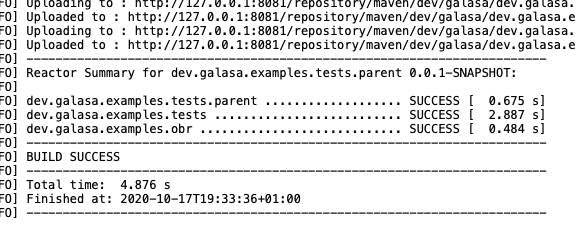
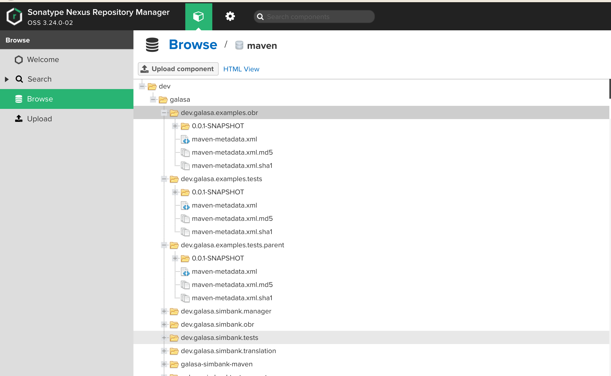

# Sample 1 Guide - Converting and running a local tests in automation

For the cabability to run in automation, all of our test engines need access to our test material. We do this by offering the material as maven artifacts, stored in a maven repository. If using the docker operator to bring up an ecosystem, a nexus repository is also instantiated, which can be used to store the artifacts. However, you can use any maven repositories you have access to.

First off we need to define to maven where we want to deploy our artifacts to. For this example I am using a local nexus repository that I brought up on my workstation. We need to create or add to the settings.xml that maven uses.

I have included a example settings.xml in this repository, that can be used to help define your own. In the example I have configured both a SNAPSHOT and release repo, which you may want to do if you have a development and release stream of your test material. Things that have been define in the file:

1. A server called example. We pass the credentials here for ease, but there is more secure solutions offered by maven.
1. A profile called example. Here we define a couple of properties that get can be used in a maven deploy setup, allowing repo locations to be changed easily, without the need to change it in 100's of locations. In this profile we also define the SNAPSHOT and release repos.

From our project we can then use this information to deploy our artifacts to a maven repository. It is simple to add a deploy location to a project as we can just add the definition to the parent project, which can then be used by the children. In the parent POM we can add the following:

The `<id>example</id>` refers to the server we setup, and the `<url>${example.*.repo}</url>` refers to the properties we setup in our profile.

The last thing to do to be able to deploy our artifats is to setup our maven run. On the command lines this would looke something like `mvn -P example clean deploy`. If you are using eclipse, then you can setup a run configuration something like this:

If we run this job we should see the following output:

Looking on the local repo (http://127.0.0.1:8081/#browse/browse:maven) we should now be able to see all of our artifacts:

