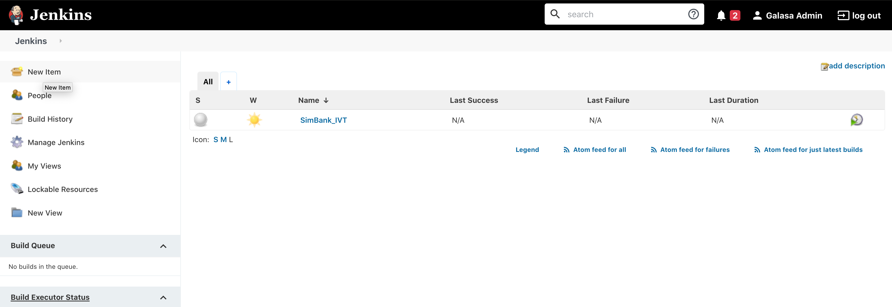
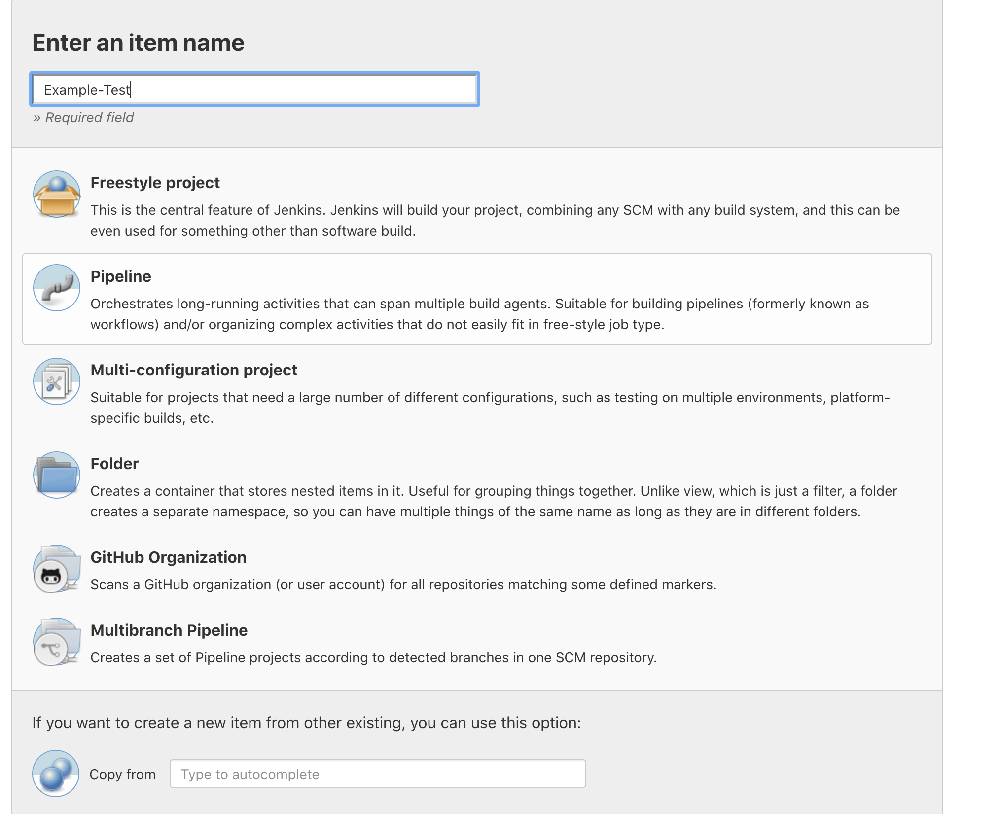
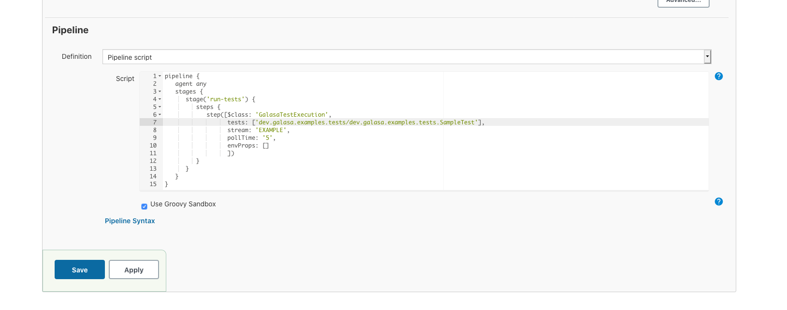
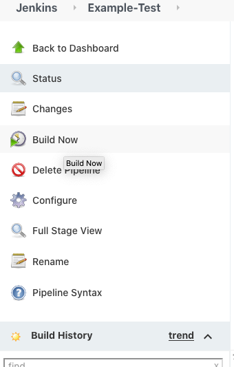
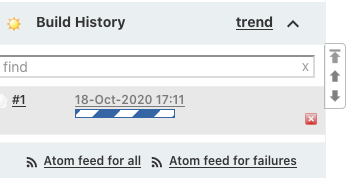
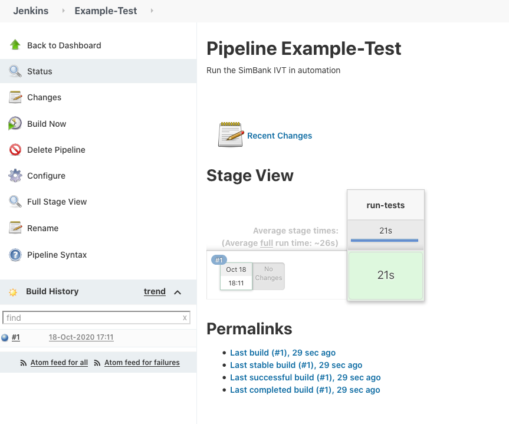

# Sample 1 Guide - Converting and running a local tests in automation

Now we have the capabilties to run test headlessly within the ecosystem, how do we submit tests from an automated pipeline like a jenkins job? Where the submissions is just a REST call, we currently support a jenkins plugin to make this easier. If you are using the docker operator, then a jenkins server that has this plugin installed is already available:



On this jenkines server we can create a new pipeline job:



Inside this job we need to create a pipeline script, like the one in this repository branch:



In this script we have to define our tests that we want to run. Note that this is an array, so we can pass as many as we like. We also have to define the stream we want to run our tests from. This is done as we sometimes like to have the structure where we have different test streams for the same test material that is in different release states (Best so far/Production). The poll time is how often jenkins requests an update on our submitted tests, as galasa is testing as a service and run off the jenkins node. The last array is an oppurtunity to pass any override properties to the tests being run.

Save and we can run our job:





Once completed we can see our results from the eclipse plugin from the Automation Runs tab:


Note that both of the Runs from our submiting from eclipse and jenkins appear as U*. If we want to defin them differently we can set properties in the CPS like:

```
framework.request.type.JENKINS.prefix=J
```

Any jenkins run jobs would then be prefixed with a J.