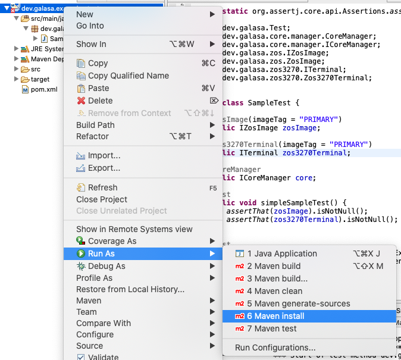
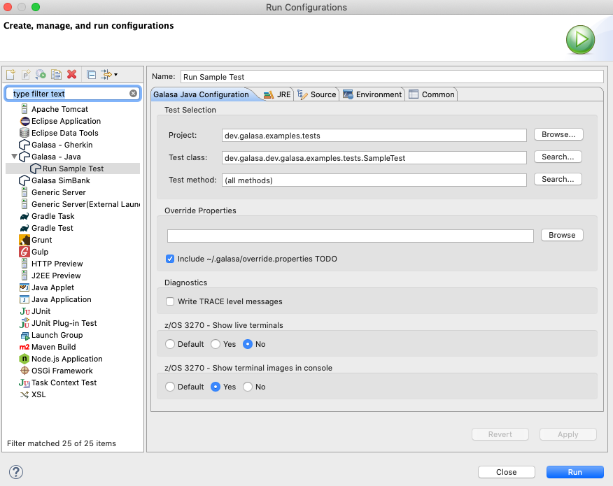

# Sample 1 Guide - Converting and running a local tests in automation

Starting with a basic test like the one shown in this branch, we are going to go through the process:

1. Converting this into a OSGi bundle wrapped project
1. Deploying the artifacts to a maven repository
1. Setting up a new test stream
1. Running the test headlessly from eclipse
1. Running in a jenkins pipeline

Each of these stages will be shown in seperate branches in this repo, all tagged with `Samples-1-*`

## Starting point
The test we are going to use is very simplistic to avoid any additional complications not relevant to setting up a new test in automation. The test case connects a 3270 emulator to a system and checks for a string we expect on OUR systems. If you are following this through using this test case please amend the test to suite your needs. You will also need to ammend the `cps.properties` and `credential.properties` to run this locally. I have included samples within this branch.


At this point if we want to run this test, we can run a maven install:



And create the run configuration:



This is all the work required to run the test locally (assuming that the correct configurations in the CPS and CREDS have been completed)

The eclipse plugin has the ability to wrapper and run this test in this raw format. Under the covers, the plugin creates a OSGi Bundle Repository(OBR) to allow galasa to run anything housed within the workspace. This can be seen in the first two lines of a test run console output:

```
17/10/2020 11:39:13.076 DEBUG dev.galasa.boot.Launcher.processCommandLine - Supplied command line arguments:
 --bootstrap file:///Users/jamesdavies/.galasa/bootstrap.properties 
 --overrides file:///var/folders/_v/kdn1r7tn1gj3h4881mn92lfr0000gn/T/galasa_eclipse_cache_3439508801795774060/galasaoverrides4839275147795675185.properties 
 --localmaven file:/Users/jamesdavies/.m2/repository/ 
 --remotemaven https://repo.maven.apache.org/maven2/ 
 --obr file:/Users/jamesdavies/Eclipse-Workspaces/2019-Galasa-Eclipse/.metadata/.plugins/dev.galasa.eclipse/workspace.obr 
 --obr mvn:dev.galasa/dev.galasa.uber.obr/0.11.0/obr 
 --test dev.galasa.examples.tests/dev.galasa.dev.galasa.examples.tests.SampleTest 

17/10/2020 11:39:13.087 DEBUG dev.galasa.boot.Launcher.launch - OBR Repository Files: [file:/Users/jamesdavies/Eclipse-Workspaces/2019-Galasa-Eclipse/.metadata/.plugins/dev.galasa.eclipse/workspace.obr, mvn:dev.galasa/dev.galasa.uber.obr/0.11.0/obr]
```

Here see the `--obr file:/Users/jamesdavies/Eclipse-Workspaces/2019-Galasa-Eclipse/.metadata/.plugins/dev.galasa.eclipse/workspace.obr ` which is created when we start our test locally and which is used by galasa to run our test.

 To run this test in automation we need to complete this work ourselves and push the resulting OBR to a maven repository, alongside all the nessessary jars containing our test material. Housing our test code and OBR's in a centeral location ensure that our test engines have access to all the resoures required to run the test. 