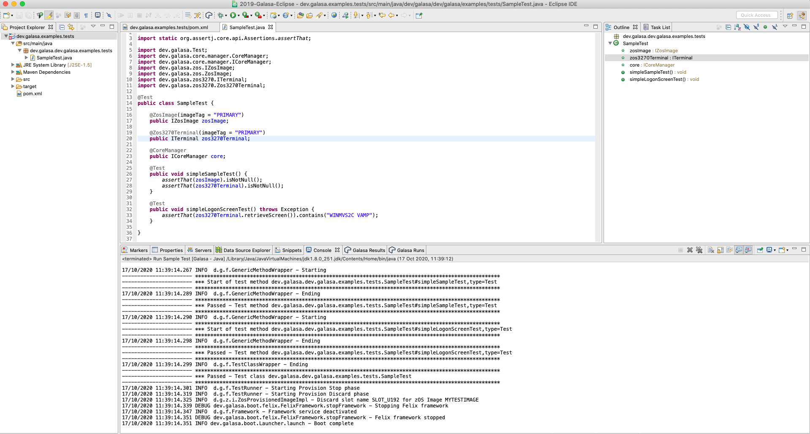

# Sample 1 Guide - Converting and running a local tests in automation

Starting with a basic test like the one shown in this branch, we are going to go through the process:

1. Converting this into a OSGi bundle wrapped project
1. Deploying the artifacts to a maven repository
1. Setting up a new test stream
1. Running the test headlessly from eclipse
1. Running in a jenkins pipeline

